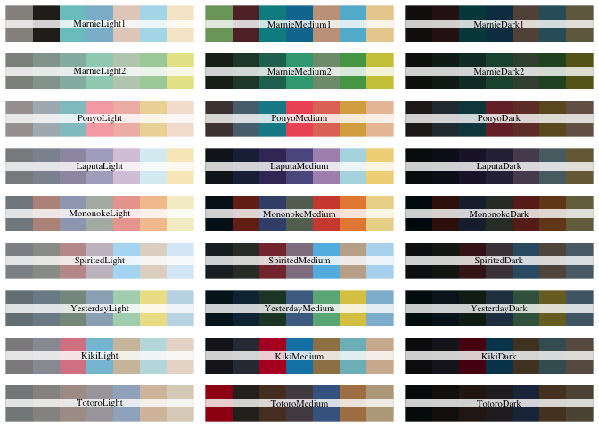
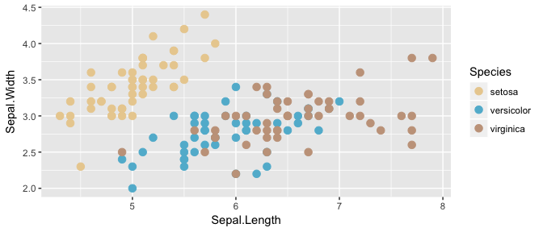
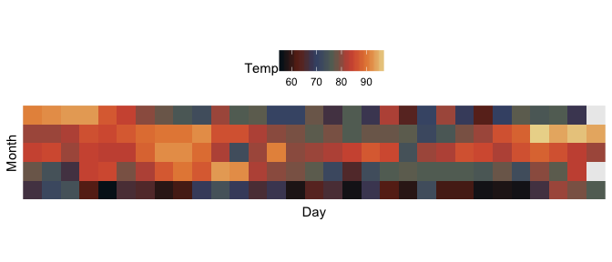

ghibli
======

[](https://travis-ci.org/ewenme/ghibli)
[]()


> ｡◕‿‿◕｡ Sprinkle some Studio Ghibli palette magic over your R plots ｡◕‿‿◕｡

Installation
------------

Get the development version from GitHub right now.

``` r
# If you haven't installed remotes yet, do so
install.packages("remotes")

# install package from github
remotes::install_github("ewenme/ghibli")
```

Palettes
--------

``` r
# load package
library(ghibli)

# see palette names and colours
par(mfrow=c(7,3))
for(i in names(ghibli_palettes)) print(ghibli_palette(i))
```



### Spirited Away


``` r
ghibli_palette("SpiritedMedium")
```


### Princess Mononoke


``` r
ghibli_palette("MononokeMedium")
```


### When Marnie Was There


``` r
ghibli_palette("MarnieMedium1")
```


### Ponyo


``` r
ghibli_palette("PonyoMedium")
```


Usage
-----

``` r
library("ggplot2")

ggplot(iris, aes(Sepal.Length, Sepal.Width, color = Species)) +
  geom_point(size = 3) +
  scale_color_manual(values = rev(ghibli_palette("MarnieMedium1"))) +
  theme_grey()
```



``` r

ggplot(airquality, aes(x=Day, y=Month)) +
  geom_tile(aes(fill=Temp)) +
  scale_fill_gradientn(colours = ghibli_palette("MononokeMedium", 21, type = "continuous")) +
  scale_x_discrete(expand = c(0, 0)) +
  scale_y_discrete(expand = c(0, 0)) +
  coord_equal() +
  theme(legend.position = "top")
```



Credits
-------

This package was inspired by (and lots of code ported from) [Karthik Ram's `wesanderson` package](https://github.com/karthik/wesanderson).

The palettes come from Love magazine's [STUDIO GHIBLI FOREVER](http://www.thelovemagazine.co.uk/posts/6584/in-photos-guess-who-s-back-retrospective-of-studio-ghibli-forever-is-here) retrospective. Go check it.
