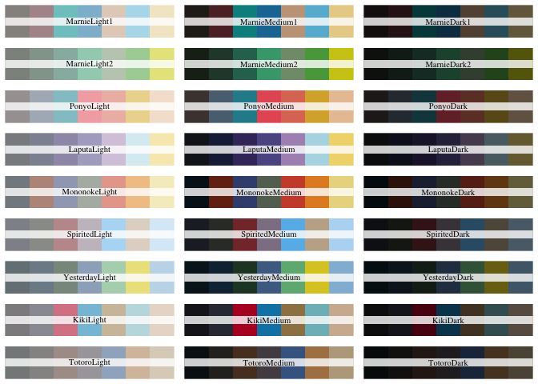
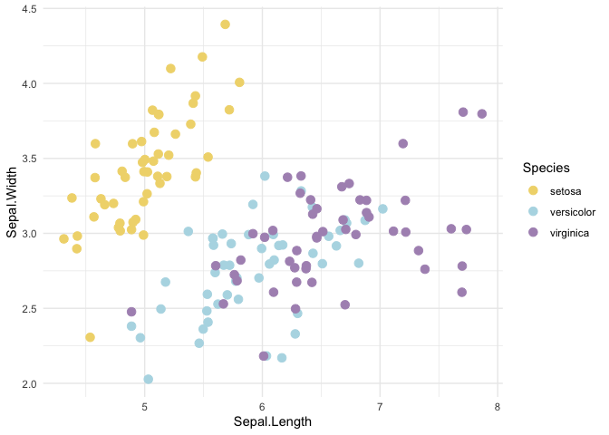

# ghibli 

[](https://www.tidyverse.org/lifecycle/#stable)
[](https://travis-ci.org/ewenme/ghibli)
[](https://cran.r-project.org/package=ghibli)
[](http://cran.rstudio.com/web/packages/ghibli/index.html)

## Overview

> “No matter how many weapons you have, no matter how great your
> technology might be, the world cannot live without love\!” —*Castle in
> the Sky (1986)*

｡◕‿‿◕｡ Sprinkle some Studio Ghibli palette magic over your plots ｡◕‿‿◕｡

<!-- -->

## Installation

Install the latest stable version on CRAN…

``` r
install.packages('ghibli')
```

…or get the development version from GitHub.

``` r
# install package from github
remotes::install_github("ewenme/ghibli")
```

## Palettes


`ghibli` provides 9 unique palettes, with a light, medium and dark
variant for each.

``` r
# load package
library(ghibli)

# display palettes w/ names
par(mfrow=c(9,3))
for(i in names(ghibli_palettes)) print(ghibli_palette(i))
```

<!-- -->

**N.B.** the palettes are [exposed in YAML
format](https://raw.githubusercontent.com/ewenme/ghibli/master/inst/extdata/palettes.yml)
for easier porting to new libraries.

All colour palettes are stored as `color` objects (courtesy of the
[prismatic](https://emilhvitfeldt.github.io/prismatic/index.html)
package) inside `ghibli_palettes` with lovely printing/plotting methods
to help you preview flavours.

``` r
plot(ghibli_palettes$MarnieMedium1)
```

<!-- -->

If [crayon](https://github.com/r-lib/crayon) is installed, the print
method will be extremely cute.


## In the wild

`ghibli` provides relevant scales for use with `ggplot2`. It only
suggests `ggplot2` in order to stay lightweight, but if available you
can use the `scale_[colour|fill]_ghibli_[c|d]()` functions:

``` r
library(ggplot2)

# ggplot stuff
ggplot(iris, aes(Sepal.Length, Sepal.Width, color = Species)) +
  geom_jitter(size = 3) +
  theme_minimal() +
  # ghibli stuff
  scale_colour_ghibli_d("LaputaMedium", direction = -1)
```

<!-- -->

## Credits

This package was largely inspired by [Karthik Ram’s `wesanderson`
package](https://github.com/karthik/wesanderson).

The palettes themselves come from [Movies in
Color](http://moviesincolor.com/). Go check ’em.
